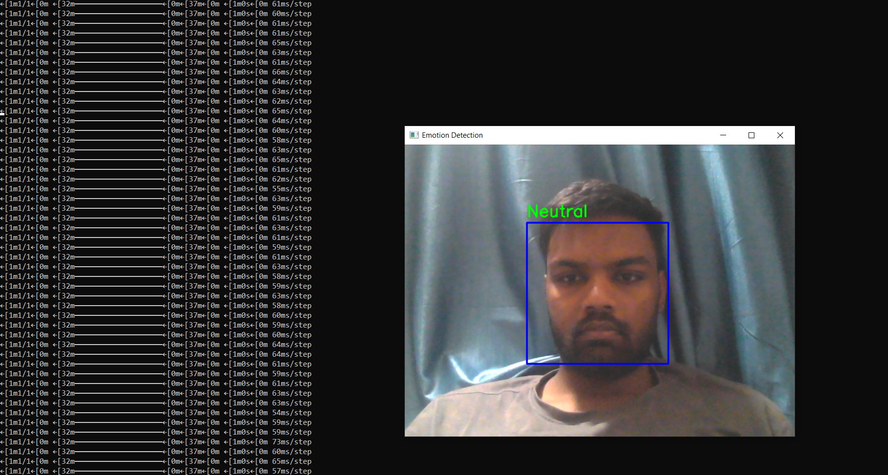
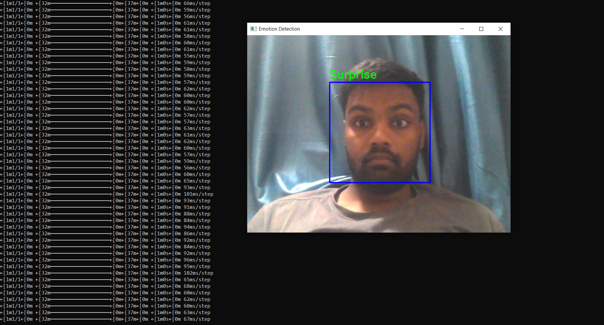

# 😊 Emotion Recognition from Facial Expressions

## 📌 Overview

This project detects human emotions in real-time using facial expressions.
It uses a Convolutional Neural Network (CNN) trained on the FER2013 dataset to classify emotions from webcam input.

---

## 🎯 Objective

* Detect faces using computer vision
* Classify emotions in real-time
* Demonstrate deep learning in human-computer interaction

---

## 🧠 Technologies Used

* Python
* TensorFlow / Keras
* OpenCV
* NumPy, Pandas

---

## ⚙️ Working Principle

1. Load and preprocess FER2013 dataset
2. Train CNN model on facial emotion data
3. Save trained model (`emotion_model.h5`)
4. Capture webcam input
5. Detect faces and predict emotions
6. Display emotion label on screen

---

## 🖼️ Output Screenshots

### 🔹 Emotion Detection Output 1



### 🔹 Emotion Detection Output 2



---

## 🚀 Features

* Real-time emotion detection
* Multiple face detection
* Lightweight CNN model
* Easy to use and implement

---

## 📂 Project Structure

* `train_model.py` → Model training script
* `detect_emotion.py` → Real-time detection
* `emotion_model.h5` → Trained model
* `sample1.png` → Output screenshot 1
* `sample2.png` → Output screenshot 2
* `README.md` → Documentation

---

## ▶️ How to Run

### Step 1: Install dependencies

```bash
pip install tensorflow opencv-python numpy pandas
```

### Step 2: Train the model (only once)

```bash
python train_model.py
```

### Step 3: Run emotion detection

```bash
python detect_emotion.py
```

---

## 📈 Future Scope

* Improve accuracy using deep learning models (CNN + Transfer Learning)
* Add emotion tracking over time
* Deploy on mobile or embedded systems

---

## 👤 Author

**Anmol Rai**
Automation & Robotics Engineering Student
